# NoteNest System Architecture & Component Topology

This document describes the high-level and low-level system architecture of NoteNest as of Phase 22 (v0.22).

---

## 1. System Topology & Network Segmentation

NoteNest utilizes containerized microservices segmented across four Docker networks for defense-in-depth isolation: `public_net` (172.20.0.0/24) for internet-facing edge services (HAProxy, Nginx, Edge-Nginx), `app_net` (172.20.1.0/24) for application microservices (Kong, App, Auth, User, GraphQL, Notification, Consul), `data_net` (172.20.2.0/24) for data stores and message brokers (Primary DB, Read Replicas, Write/Read PgBouncers, Redis, MinIO, Kafka, RabbitMQ), and `mgmt_net` (172.20.3.0/24) for management and observability (Consul, Bastion). HAProxy provides external L7 round-robin load balancing and consistent path hashing for WebSockets. HashiCorp Consul provides dynamic service registry and health-checked service discovery for gRPC load balancing across all internal services.

```mermaid
graph TD
    subgraph ClientLayer["Client Layer"]
        Browser["Web Browser / Client Applications"]
    end

    subgraph PublicNet["Public Network (public_net - 172.20.0.0/24)"]
        HAProxy["External HAProxy LB<br/>Port 80 (Round-Robin + WS Consistent Hashing)"]
        NginxProxy["Nginx Main Proxy<br/>Port 8082"]
        EdgeCDN["Edge Nginx CDN Node<br/>Port 8081<br/>/var/cache/nginx/cdn"]
    end

    subgraph AppNet["Application Network (app_net - 172.20.1.0/24)"]
        KongGateway["Kong API Gateway<br/>Port 8000<br/>DB-less declarative mode"]
        Consul["HashiCorp Consul<br/>Port 8500 (HTTP API / DNS)<br/>Service Registry & Discovery"]
        AuthService["Python Auth Service<br/>Port 50051 (gRPC)<br/>Argon2id + JWT Token Engine"]
        UserService["Python User Service<br/>Port 50052 (gRPC)<br/>User Profile Querying"]
        NoteService["C++ Note Service<br/>Port 50053/50054 (gRPC) & Port 8080 (REST/SSE/WS)<br/>Note CRUD + Yjs WebSockets + OutboxRelay"]
        AttService["C++ Attachment Service<br/>Port 50054 (gRPC)<br/>S3 Presigned URLs + Quota"]
        GraphQL["GraphQL Microservice<br/>Port 4000<br/>Apollo Server 4 + DataLoader"]
        NotificationService["Python Notification & PDF Worker<br/>Kafka Consumer + RabbitMQ Worker"]
    end

    subgraph DataNet["Data Network (data_net - 172.20.2.0/24)"]
        PgBouncerWrite["PgBouncer Write Pooler<br/>Port 6432 (Primary Routing)"]
        PgBouncerRead["PgBouncer Read Pooler<br/>Port 6433 (Replica Round-Robin Routing)"]
        Redis["Redis Cache<br/>Port 6379<br/>Cache-aside + Gateway Limits + Idempotency"]
        DBPrimary[("PostgreSQL 15 Primary DB<br/>Port 5432 (WAL Level: Replica)")]
        DBReplica1[("PostgreSQL 15 Read Replica 1<br/>Port 5432 (Hot Standby)")]
        DBReplica2[("PostgreSQL 15 Read Replica 2<br/>Port 5432 (Hot Standby)")]
        OriginNginx["Origin Nginx Gateway<br/>Port 9005"]
        MinIO[("MinIO S3 Storage<br/>Ports 9000 / 9001")]
        KafkaBroker["Kafka KRaft Broker<br/>Port 9092<br/>note.events & DLT"]
        RabbitMQBroker["RabbitMQ Broker<br/>Port 5672 / 15672<br/>pdf.requests RPC queue"]
    end

    subgraph MgmtNet["Management Network (mgmt_net - 172.20.3.0/24)"]
        Bastion["Alpine Bastion Host<br/>Cross-network admin access"]
    end

    AuthService -->|"Register & TTL Heartbeat"| Consul
    UserService -->|"Register & TTL Heartbeat"| Consul
    NoteService -->|"Register & TTL Heartbeat"| Consul
    AttService -->|"Register & TTL Heartbeat"| Consul
    NotificationService -->|"Register & TTL Heartbeat"| Consul
    GraphQL -->|"Register & TTL Heartbeat"| Consul

    NoteService -->|"Consul Service Discovery"| Consul
    NotificationService -->|"Consul Service Discovery"| Consul

    Browser -->|HTTP GET/POST /api| HAProxy
    Browser -->|HTTP SSE /api/events| HAProxy
    Browser -->|WebSocket /api/notes/:id/ws| HAProxy
    Browser -->|GraphQL /api/graphql| HAProxy
    Browser -->|HTTP PUT/GET Attachments| EdgeCDN

    HAProxy -->|"Round-Robin / WS Hashing"| NginxProxy
    NginxProxy -->|"Proxy /api/* (HTTP/SSE/WS/GraphQL)"| KongGateway
    NginxProxy -->|Proxy /notenest-attachments/*| EdgeCDN

    KongGateway -->|Redis Rate Limits & JWT Offload| Redis
    KongGateway -->|Forward Valid REST / SSE / WS| NoteService
    KongGateway -->|Forward /graphql Requests| GraphQL

    EdgeCDN -->|Cache Miss Proxy| OriginNginx
    OriginNginx -->|S3 Protocol| MinIO

    NoteService -->|"gRPC (VerifyToken/Signup/Login)"| AuthService
    NoteService -->|"gRPC (GetUserProfile)"| UserService
    NoteService -->|"gRPC (GenerateUploadUrl)"| AttService
    NoteService -->|"Transactional Outbox Insert"| PgBouncerWrite
    NoteService -->|"Produce note.events (librdkafka)"| KafkaBroker
    NoteService -->|"RabbitMQ RPC pdf.requests (librabbitmq)"| RabbitMQBroker

    KafkaBroker -->|"Subscribe note.events"| NotificationService
    RabbitMQBroker -->|"Consume pdf.requests"| NotificationService
    NotificationService -->|"gRPC Notify (Port 50054)"| NoteService

    AuthService -->|"Write SQL"| PgBouncerWrite
    AuthService -->|"Read SQL (Fallback Primary)"| PgBouncerRead
    UserService -->|"Read SQL (Fallback Primary)"| PgBouncerRead
    NoteService -->|"Mutations SQL"| PgBouncerWrite
    NoteService -->|"SELECT Queries (Fallback Primary)"| PgBouncerRead
    GraphQL -->|"Mutations"| PgBouncerWrite
    GraphQL -->|"Queries (Fallback Primary)"| PgBouncerRead

    PgBouncerWrite -->|"Write Transactions"| DBPrimary
    PgBouncerRead -->|"Read Transactions"| DBReplica1
    PgBouncerRead -->|"Read Transactions"| DBReplica2
    DBPrimary ==>|"WAL Streaming Physical Replication"| DBReplica1
    DBPrimary ==>|"WAL Streaming Physical Replication"| DBReplica2

    Bastion -.->|"Admin Access"| HAProxy
    Bastion -.->|"Admin Access"| NoteService
    Bastion -.->|"Admin Access"| Redis
    Bastion -.->|"Admin Access"| Consul
```

---

## 2. gRPC Microservice Communication & Tracing Flow

Internal services communicate via Protobuf RPCs with gRPC metadata carrying `trace-id` context. Token verification on the per-request hot path is done locally in C++ using HMAC-SHA256 (Kong has already verified the signature upstream; local verify is ~5-10μs). The Python Auth gRPC service is only called for `signup` and `login` (Argon2id password hashing).

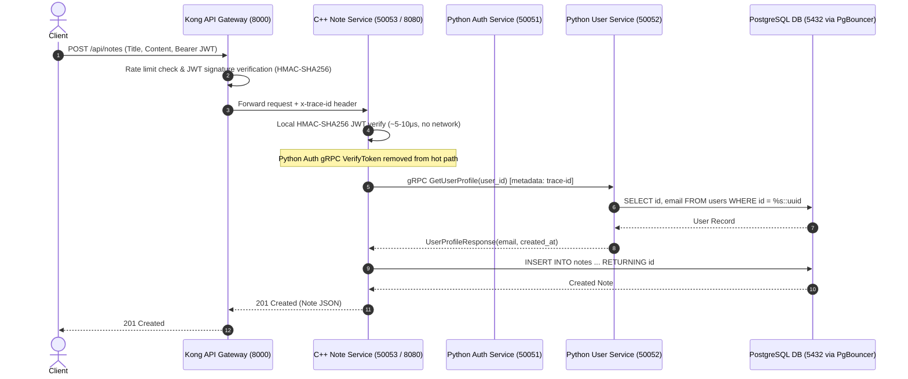

---

## 3. API & Database Request Flow (Notes & Auth)

Authentication uses Argon2id password hashing and OpenSSL HMAC-SHA256 JWT tokens offloaded to Kong API Gateway. Ingress traffic is checked against Redis rate-limiting counters. Note queries follow the **Cache-Aside** pattern with key-level locking for stampede protection.

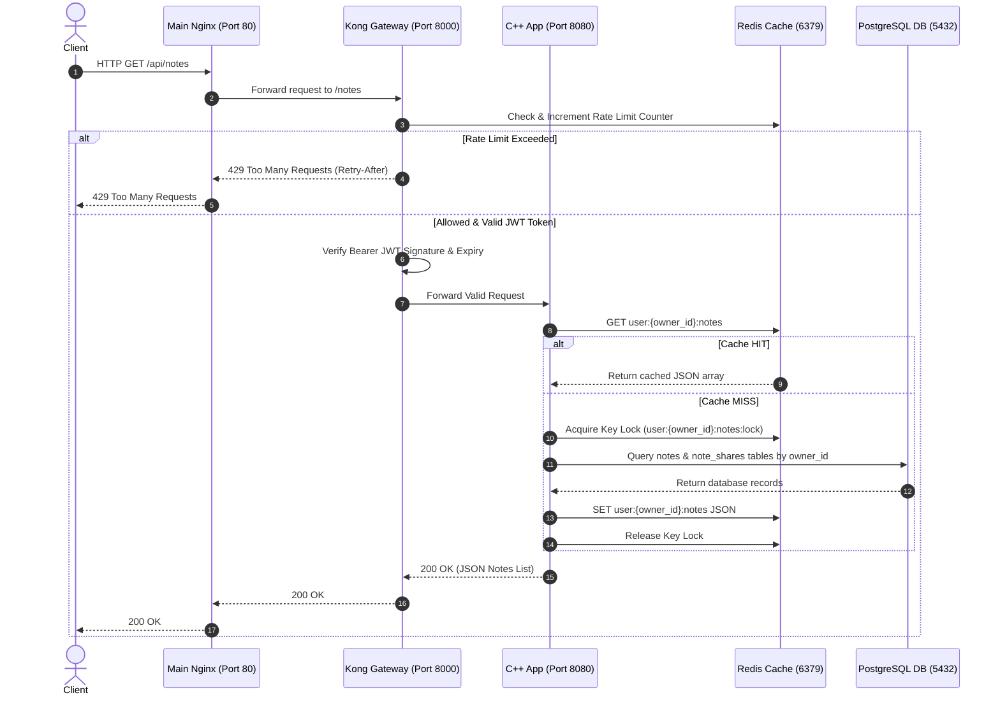

---

## 4. Attachment Upload Flow (Presigned S3 PUT)

Attachment uploads use custom S3 AWS Signature Version 4 presigned URLs.

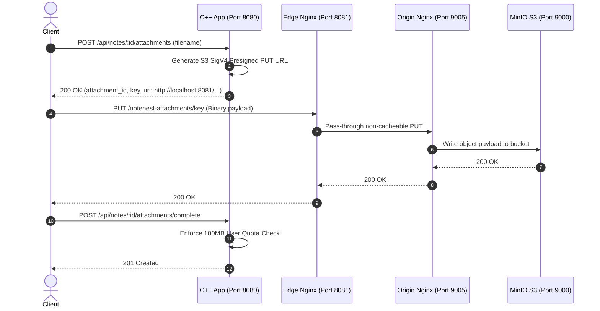

---

## 5. CDN Attachment Download & Edge Caching Flow

CDN Edge caching operates on disk (`/var/cache/nginx/cdn`) using proxy cache keys (`$scheme$proxy_host$uri`).

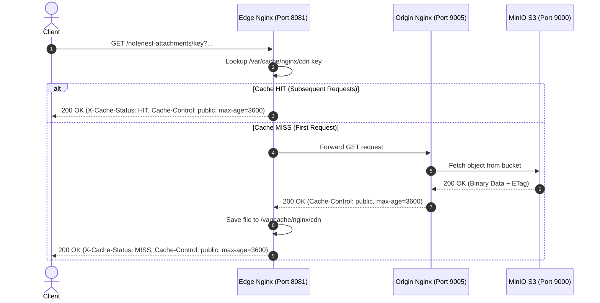

---

## 6. Real-Time Server-Sent Events (SSE) & Note Sharing Flow

Server-Sent Events (`text/event-stream`) provide real-time notification streams. Subscriptions connect via `GET /api/events?token=...`, managed by `EventBus`.

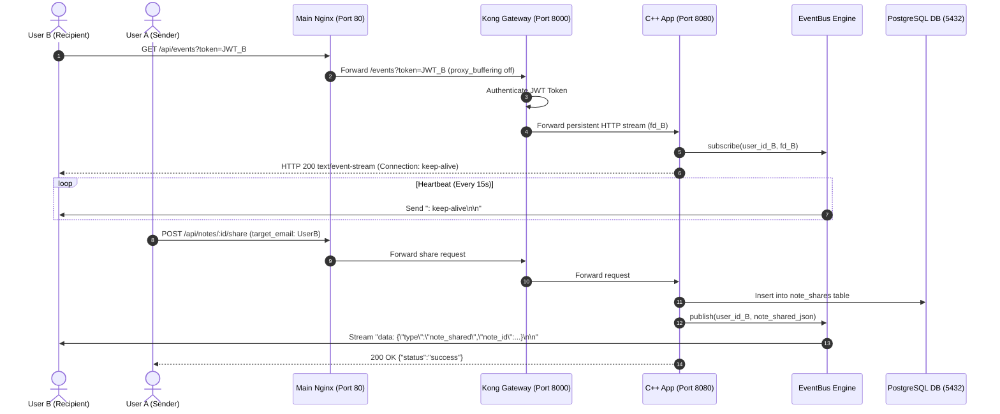

---

## 7. Real-Time WebSockets & Yjs CRDT Collaboration Flow

WebSockets (RFC 6455) enable live multi-user CRDT collaboration, remote cursor tracking, and presence events per note room (`note:{id}`), managed by `RoomRegistry` and Yjs + CodeMirror 6.

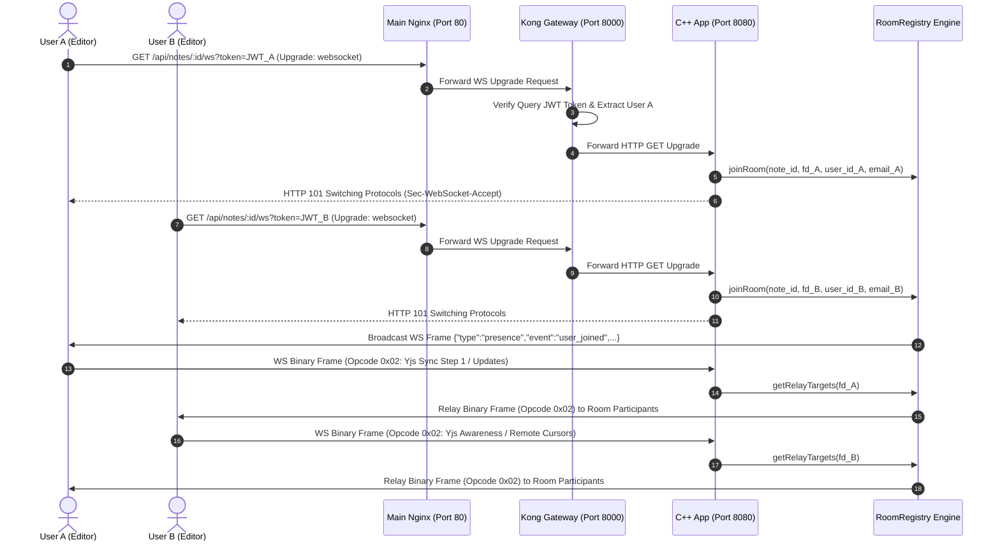

---

## 8. GraphQL Layer & DataLoader Batching Flow

The GraphQL microservice eliminates multiple REST client round-trips by allowing clients to fetch Note, Author, and Comments in a single request. DataLoader solves the N+1 database query problem by batching individual ID lookups into single SQL `ANY($1::uuid[])` queries.

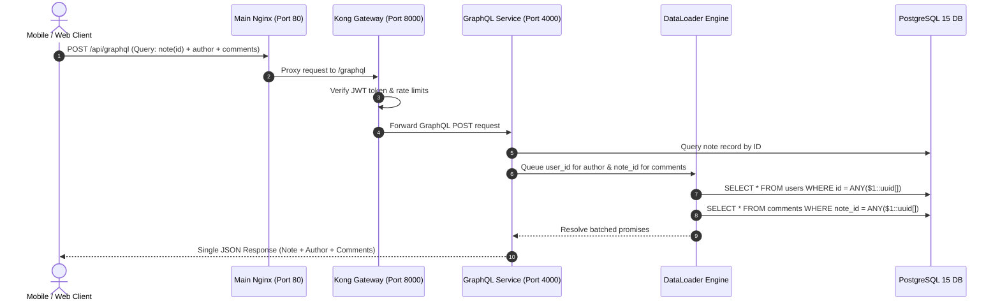

---

## 9. Kafka Event Bus, Outbox Pattern, & Message Queue Architecture (v0.15)

Phase 15 introduces durable asynchronous event streaming via Kafka, transactional event dispatch via the Outbox Pattern, and point-to-point RPC via RabbitMQ.

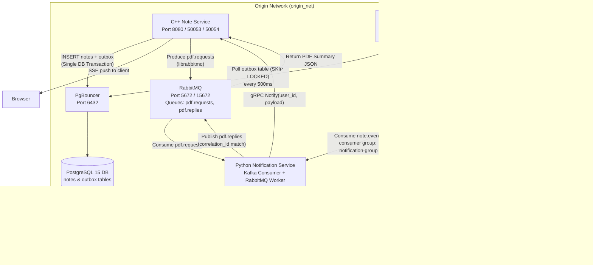

---

## 10. Observability Architecture: Logs, Metrics, Traces (v0.19)

Phase 19 integrates full 360° observability across all microservices using the Grafana LGTM stack (Loki, Grafana, Tempo, Prometheus) plus OpenTelemetry Collector and Alertmanager.

```mermaid
graph TD
    subgraph Microservices["Microservices Tier (app_net)"]
        App["C++ Note Service (app)<br/>Port 8080 /metrics"]
        Auth["Python Auth Service (auth)<br/>Port 9101 /metrics"]
        User["Python User Service (user)<br/>Port 9102 /metrics"]
        Notif["Python Notification Service<br/>Port 9103 /metrics"]
        GraphQL["GraphQL Service<br/>Port 4000 /metrics"]
    end

    subgraph ObservabilityStack["Observability & Management Tier (mgmt_net / app_net)"]
        Prometheus["Prometheus (Port 9090)<br/>Scrapes /metrics every 5s"]
        Alertmanager["Alertmanager (Port 9093)<br/>Alert rules: HighErrorRate (>1%)"]
        Promtail["Promtail Agent<br/>Tails Docker container JSON stdouts"]
        Loki["Loki Log Store (Port 3100)<br/>Indexes by container, service, trace_id"]
        OTELCol["OTEL Collector (Ports 4317/4318)<br/>OTLP gRPC/HTTP receiver"]
        Tempo["Tempo Trace Store (Port 3200)<br/>Distributed waterfall trace spans"]
        Grafana["Grafana Dashboards (Port 3000)<br/>Single-pane view for Metrics, Logs, Traces"]
    end

    App -->|Prometheus Metrics| Prometheus
    Auth -->|Prometheus Metrics| Prometheus
    User -->|Prometheus Metrics| Prometheus
    Notif -->|Prometheus Metrics| Prometheus
    GraphQL -->|Prometheus Metrics| Prometheus

    App -->|stdout JSON logs| Promtail
    Auth -->|stdout JSON logs| Promtail
    User -->|stdout JSON logs| Promtail
    Notif -->|stdout JSON logs| Promtail
    GraphQL -->|stdout JSON logs| Promtail

    App -->|OTLP Traces| OTELCol
    Auth -->|OTLP Traces| OTELCol
    User -->|OTLP Traces| OTELCol
    Notif -->|OTLP Traces| OTELCol

    Promtail -->|Push Log Streams| Loki
    OTELCol -->|Batch & Export Spans| Tempo
    Prometheus -->|Rule Evaluation| Alertmanager

    Grafana -->|Query Metrics| Prometheus
    Grafana -->|Query Logs & TraceID Link| Loki
    Grafana -->|Query Traces| Tempo
```

### Observability Features:
1. **Prometheus RED Metrics:** Tracks Request Rate (`http_requests_total`), Error Rate (`status=~"5.*"`), Latency Histograms (`http_request_duration_seconds`), and custom Kafka Consumer Lag (`kafka_consumer_lag`).
2. **Structured JSON Logs & Loki:** Container stdout logs formatted as JSON with fields `timestamp`, `level`, `service`, `trace_id`, `span_id`, and `message`.
3. **OpenTelemetry & Tempo Tracing:** W3C `traceparent` (`00-{trace_id}-{span_id}-01`) header propagation across HTTP endpoints, gRPC metadata, and Kafka message headers, rendered as distributed waterfall traces in Grafana Tempo.
4. **Grafana Unified UI & Alerting:** Grafana dashboard at `http://localhost:3000` pre-configured with Prometheus, Loki, and Tempo datasources, featuring derived field trace navigation (`Loki log` $\rightarrow$ `Tempo trace`). Alertmanager alerts on `HighErrorRate` (> 1%).

---

## 11. Kubernetes & Helm Cluster Architecture (v0.20)

Phase 20 introduces full Kubernetes orchestration via Helm 3, providing self-healing pod recovery, dynamic horizontal pod autoscaling (HPA), zero-downtime rolling updates, and declarative resource management.

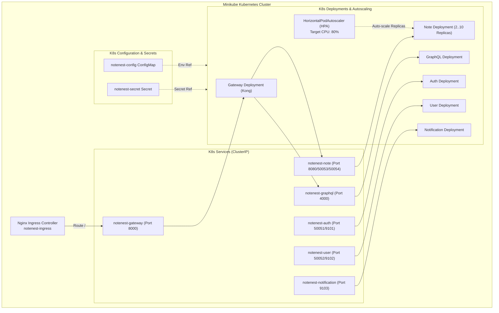

---

## 12. Database Streaming Replication & Read/Write Splitting (v0.21)

NoteNest implements physical WAL streaming replication (1 Primary + 2 Read Replicas) paired with a dual PgBouncer pooler architecture and automatic client fallback.

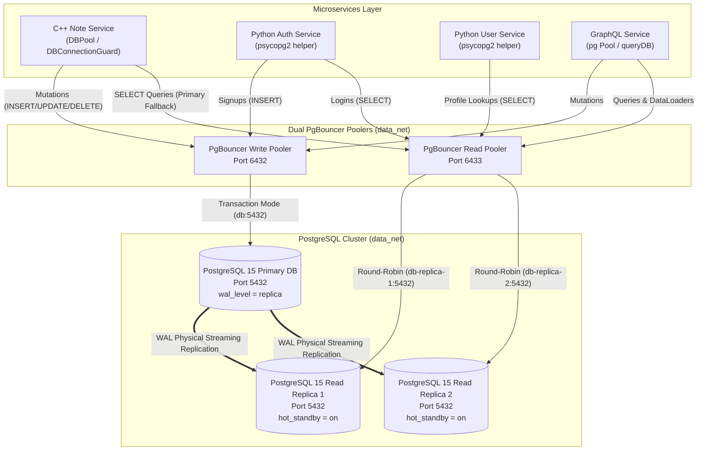

### Key Architectural Characteristics
- **WAL Physical Streaming Replication**: Primary Postgres configured with `wal_level = replica`, `max_wal_senders = 10`, `max_replication_slots = 10`, and `hot_standby = on`. Read Replicas are initialized via `pg_basebackup -R` and stream WAL records asynchronously with near-zero latency (<5ms / 0 bytes lag).
- **Dual PgBouncer Connection Pools**: `pgbouncer-write` (port 6432) routes mutation traffic to Primary (`db:5432`). `pgbouncer-read` (port 6433) load-balances read traffic across `db-replica-1:5432` and `db-replica-2:5432` via Docker DNS round-robin (`db-replicas`).
- **Application Read/Write Splitting**: C++ `DBPool` / `DBConnectionGuard` (`DBPoolMode::READ` & `DBPoolMode::WRITE`), Python (`auth`, `user`), and Node.js (`graphql`) route read queries (`SELECT`) to `pgbouncer-read` and mutations (`INSERT`, `UPDATE`, `DELETE`) to `pgbouncer-write`.
- **Automatic Fallback to Primary**: If read replicas or read pool are unavailable or circuit breaker opens, `DBConnectionGuard` and microservice DB helpers catch read errors and automatically fall back to `pgbouncer-write` (Primary DB) to guarantee 100% service uptime with zero dropped requests.
- **Lag Monitoring**: Replicas are monitored via `pg_stat_replication` (`scripts/check_replica_lag.sh`); replicas exceeding 10MB replication lag are marked unready.

---

## 13. Terraform Infrastructure as Code Architecture (v0.22)

Phase 22 introduces declarative Infrastructure as Code (IaC) using Terraform with the `kreuzwerker/docker` provider.

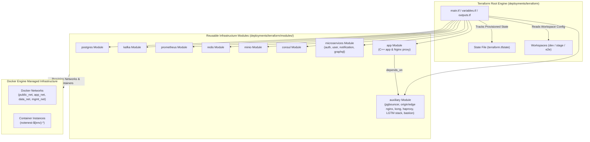

### Key Architectural Characteristics
- **Modular Infrastructure Breakdown**: Split into 9 reusable modules under `deployments/terraform/modules/` (`postgres`, `kafka`, `prometheus`, `redis`, `minio`, `consul`, `microservices`, `auxiliary`, `app`).
- **Workspace Isolation**: Supports dynamic workspace environments (`dev`, `stage`, `e2e-test-ws`) via `terraform workspace`. Resource naming (`notenest-${env}-*`) and subnet allocations auto-scope per workspace to avoid address collisions.
- **Provider Abstraction**: Built on `kreuzwerker/docker` provider to simulate multi-tier cloud infrastructure locally, with clean paths to swap with cloud providers (`hashicorp/aws`, `hashicorp/google`).
- **State Tracking & Lifecycle Validation**: Validated via `tests/suites/22_terraform.sh` covering `init`, `validate`, `plan`, `apply`, live container inspection, state checking, and clean `destroy`.

---

## 14. CI/CD Workflows & Security Automation Pipeline Architecture (v0.23)

Phase 23 introduces GitHub Actions CI/CD workflows, GitHub Container Registry (GHCR) container image publishing, GitOps deployment automation, and automated security scanning.

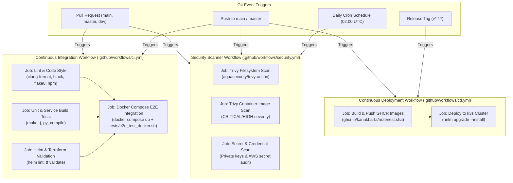

### Key Architectural Characteristics
- **Multi-Stage CI Pipeline (`ci.yml`)**: Automated code linting (`clang-format`, `black`, `flake8`, `npm build`), binary compilation (`make -j`), infrastructure linting (`helm lint`, `terraform validate`), and ephemeral container E2E integration test execution on pull requests and branch updates.
- **Continuous Deployment & Registry (`cd.yml`)**: Multi-stage image build and push to GitHub Container Registry (`ghcr.io/${{ github.repository_owner }}/notenest`), tagged with Git SHA and `latest`. Automates GitOps release upgrades to k3s cluster using Helm charts.
- **Security & Secret Governance (`security.yml`)**: Continuous vulnerability scanning using Aquasecurity Trivy for filesystem dependencies and built container images, combined with automated repository secret audits to prevent key leakages.
- **Branch Protection & Verification**: Enforces required CI status checks (`lint-code`, `unit-and-integration-tests`, `helm-and-tf-validation`, `docker-e2e-integration`) prior to PR merge. Validated via `tests/suites/23_cicd_workflows.sh`.

